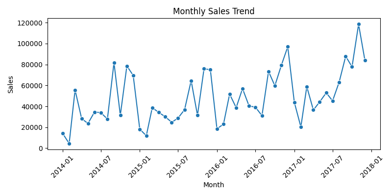
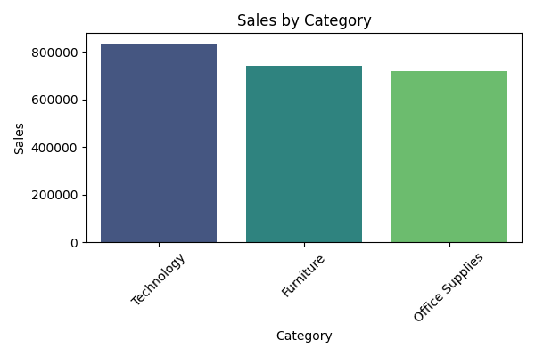

# Sales Data Analysis

## Overview

This project analyzes a retail sales dataset to identify top-performing products, seasonal trends, and customer segments. The goal is to derive actionable insights that can drive business strategy and improve operational efficiency.

## Data Source

Provide a CSV or database with historical sales data including transaction date, product ID, quantity sold, revenue, customer demographics, and marketing channel. Replace this section with details of your own dataset.

## Analysis Steps

1. **Data Cleaning** – Handle missing values, correct data types, and remove outliers.
2. **Exploratory Data Analysis (EDA)** – Compute summary statistics and visualize sales distributions, seasonality, and product performance.
3. **Segmentation** – Identify customer segments based on purchasing behavior and demographic attributes.
4. **Visualization and Reporting** – Create dashboards or charts to communicate findings to stakeholders.

## Tools Used

- Python (pandas, NumPy, matplotlib, seaborn)
- Jupyter Notebook or any IDE
- Optional: Tableau/Power BI for interactive dashboards

## Results

Summarize key findings such as best-selling products, seasonal peaks, and customer segments. Add graphs or tables as needed.

## Next Steps

Extend the analysis by incorporating marketing spend, promotional periods, or cross-selling opportunities.

## Example Visualizations

Below are example charts from the sales analysis:

